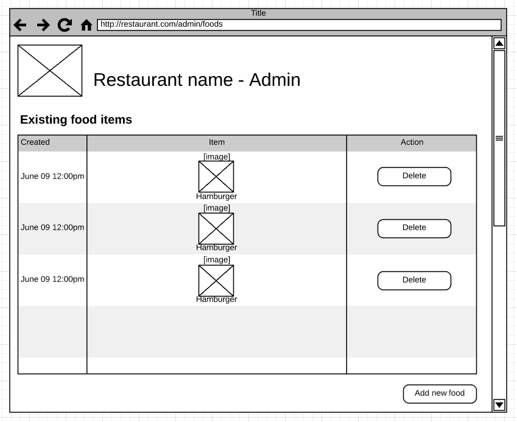
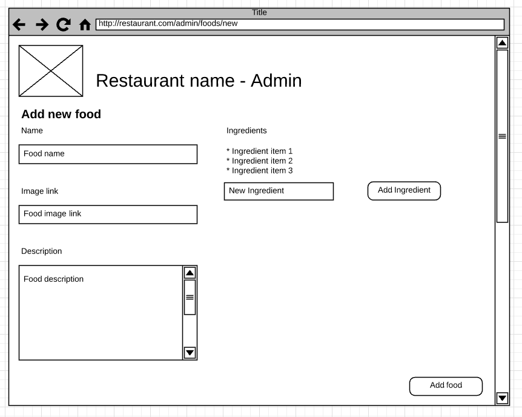
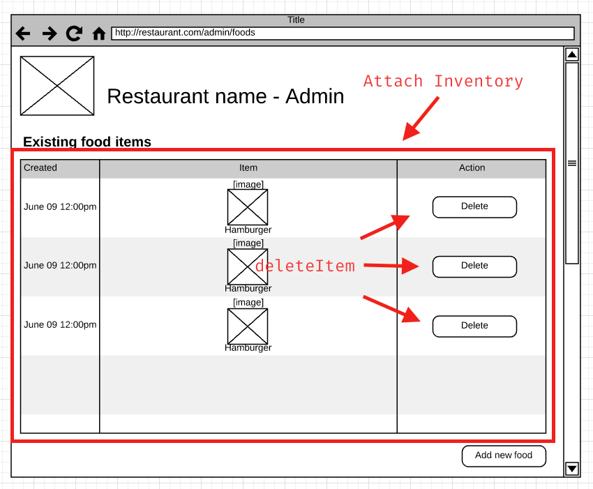
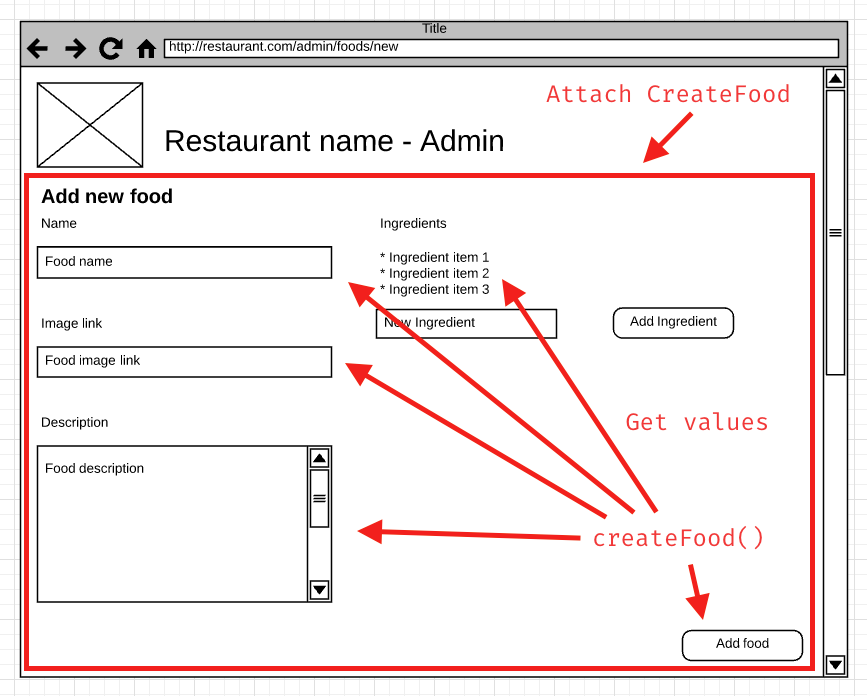

# Homework 1

## Deliverables

* HTML & CSS
	* Create-food-item.html [2 pts]
	* Inventory.html [2 pts]
* JavaScript
	* Inventory component [2 pts]
	* Menu component [1 pts]
	* Create food component [3 pts]
	* updated app.js with components above
* Pushes changes to Github pages under hw1
* CSNS file showing URL of Github pages & Github pull request

Example CSNS file format:

```
Application URL:
https://csula-students.github.io/cs-3220-summer-2017-rcliao/hw1

Github Pull Request URL:
https://github.com/csula-students/cs-3220-summer-2017-rcliao/pull/3
```

### Bonus [2 pts]

Bonus is to implement the missing piece of controlling the order statuses. You
will need to design and create a admin control panel to control order statuses.
Upon update on order statuses, the homepage (index.html) should show the up-to-date
order statuses.

## Description

Continue where we left over from lab1 and lab2, we want a fully working
front-end application that can do the food ordering as well as the admin
control for the restaurant application.

Sitemap can be found below:


New pages needed on top of lab 1 and 2 can be found below:




> You should create these two pages under "admin" folder! e.g. hw1/admin/inventory.html
& hw1/admin/create-food.html

In regards of the component and its DOM element:




## Requirements

All buttons and forms on the page should be working with proper style. In
example, if user click on add food item to cart, cart should show the
correct items. When user orders the item, it should show up under the
statuses.html.

In detail:

* User should be able to create new food item from create-food-item form
* User should be able to see inventory list
* User should be able to remove food item from inventory page
* User should be able to see updated food menu after adding/removing food from inventory

> Note that all the functionalities (behavior) should be done in JavaScript

## Instructions

Code explains better than any instruction!

```js
// continue from Lab2 with Store, CheckoutButton, Cart components
class Inventory {
    constructor(root, store) {
        this.root = root;
        this.store = store;
        this.init();
    }

    init () {
        this.render();
        // TODO: attach event listeners like click to remove items after rendering
    }

    destroy () {
        // TODO: remove event listeners added from the init above
    }

    removeItem (itemName) {
        // TODO: function to remove item given item name from store
    }

    render () {
        // using innerHTML to render inventory listing
    }
}

class Menu {
    constructor(root, store) {
        this.root = root;
        this.store = store;
        this.init();
    }

    init () {
        this.render();
    }

    render () {
        // TODO: render a list of food menu from store using innerHTML
    }
}

class CreateFood {
    constructor(root, store) {
        this.root = root; // root should be the container of the form itself
        this.store = store;
        this.init();
    }

    init () {
        // attach click event to create button
    }

    createFood () {
        // will need to do querySelector to find out every single form element
        // to get their values before creating a new food
        // after creating a new food item, add it to store
    }
}
```
